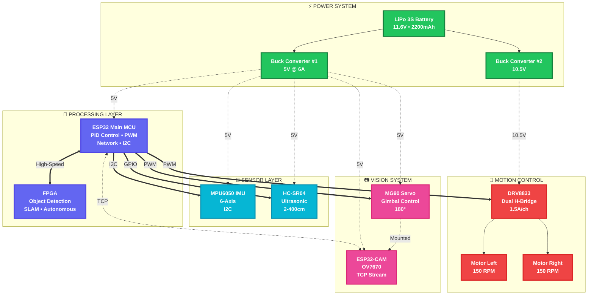

```mermaid
graph TB
    subgraph Power["⚡ POWER SYSTEM"]
        Battery["LiPo 3S Battery<br/>11.6V • 2200mAh"]
        Buck1["Buck Converter #1<br/>5V @ 6A"]
        Buck2["Buck Converter #2<br/>10.5V"]
        
        Battery --> Buck1
        Battery --> Buck2
    end
    
    subgraph Processing["🧠 PROCESSING LAYER"]
        ESP32["ESP32 Main MCU<br/>PID Control • PWM<br/>Network • I2C"]
        FPGA["FPGA<br/>Object Detection<br/>SLAM • Autonomous"]
        
        ESP32 <==>|High-Speed| FPGA
    end
    
    subgraph Sensors["📡 SENSOR LAYER"]
        MPU6050["MPU6050 IMU<br/>6-Axis<br/>I2C"]
        HCSR04["HC-SR04<br/>Ultrasonic<br/>2-400cm"]
    end
    
    subgraph Vision["📷 VISION SYSTEM"]
        ESP32CAM["ESP32-CAM<br/>OV7670<br/>TCP Stream"]
        Servo["MG90 Servo<br/>Gimbal Control<br/>180°"]
        
        Servo -.->|Mounted| ESP32CAM
    end
    
    subgraph Motion["🚗 MOTION CONTROL"]
        Driver["DRV8833<br/>Dual H-Bridge<br/>1.5A/ch"]
        MotorL["Motor Left<br/>150 RPM"]
        MotorR["Motor Right<br/>150 RPM"]
        
        Driver --> MotorL
        Driver --> MotorR
    end
    
    %% Power Distribution
    Buck1 -.->|5V| ESP32
    Buck1 -.->|5V| ESP32CAM
    Buck1 -.->|5V| MPU6050
    Buck1 -.->|5V| HCSR04
    Buck1 -.->|5V| Servo
    Buck2 -.->|10.5V| Driver
    
    %% Control Connections
    ESP32 ==>|I2C| MPU6050
    ESP32 ==>|GPIO| HCSR04
    ESP32 ==>|PWM| Servo
    ESP32 ==>|PWM| Driver
    ESP32 <-.->|TCP| ESP32CAM
    
    %% Styling
    classDef powerStyle fill:#22c55e,stroke:#15803d,stroke-width:3px,color:#fff,font-weight:bold
    classDef procStyle fill:#6366f1,stroke:#4f46e5,stroke-width:3px,color:#fff,font-weight:bold
    classDef sensorStyle fill:#06b6d4,stroke:#0891b2,stroke-width:3px,color:#fff,font-weight:bold
    classDef visionStyle fill:#ec4899,stroke:#db2777,stroke-width:3px,color:#fff,font-weight:bold
    classDef motionStyle fill:#ef4444,stroke:#dc2626,stroke-width:3px,color:#fff,font-weight:bold
    
    class Battery,Buck1,Buck2 powerStyle
    class ESP32,FPGA procStyle
    class MPU6050,HCSR04 sensorStyle
    class ESP32CAM,Servo visionStyle
    class Driver,MotorL,MotorR motionStyle
```
